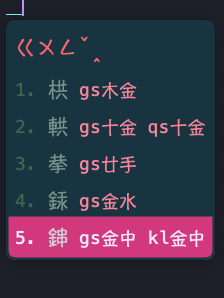
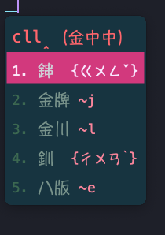

# About
小鶴雙拼的音碼+倉頡第五版速成的形碼的 Rime 繁體中文輸入方案。
兩個輸入法都是輸入 2 碼出字，打字上的節奏感很一致，但都有個共同的缺點，很常出現需要選字的情況。
兩者一起使用可以大幅降低需要選字的情況，前兩碼為雙拼後兩碼為速成，同時也讓用戶不至於忘記中文字長怎樣。
原版的小鶴音形是發明新的形碼來拆解簡體中文字，對繁體字用戶來說有幾個問題
1. 額外的拆字規則學習成本跟難度，規則夠不夠完善，教學文件夠不夠充分等。
2. 簡體轉繁體非一對一，很多是一對多。
3. 打字上不直覺，在腦中要先建立簡繁的對應關係。
因此，在設計此方案時，形碼的輸入法選擇上，便是從那些已經長時間存在，教學資源遍地都是的輸入法裡開始挑選，
最終採用速成是因為規則夠簡單，倉頡的字根數量相較於嘸蝦米、行列來說很少，加上優秀跨平台特性，
幾乎各平台有倉頡便會有速成，熟悉此輸入法後，即使只用其中一種應該都不會有太大問題。

本方案主要有三個配置檔
1. flypy_luna.scheme.yaml, 字碼基本同 Rime 內建的小鶴雙拼，都是轉譯成 Luna 拼音，但此方案的基礎設定都在此
2. flypy_self.scheme.yaml, 字碼改用轉換後字碼表，不經過轉譯
3. flypy_quick5.scheme.yaml, 本方案主要的輸入法

# 預設配置
## 模糊匹配
允許長度 2~4 的模糊碼，只單獨輸入 2 碼時跟雙拼輸入法一樣，但因為自動匹配長度的關係，長字串有時畫面上可能出現的不是你想要的，
這時開始選字詞，Rime 應該會慢慢修正到正確的詞彙。另一個方式是輸入過程中適時地手動輸入斷句符號 `'` 幫助 Rime 斷詞。


也可以關閉模糊匹配，改成需要完整輸入 4 碼
把 `flypy_quick5.schema.yaml` 的 speller 改成
```.yaml
algebra: []
```

## 按鍵輸入提示
本方案雖是用小鶴拼音的鍵位，但顯示上是使用注音符號配合倉頡字根，讓熟悉注音跟倉頡的用戶清楚知道目前輸入了什麼。
因此在純雙拼的 flypy_luna 跟 flypy_self 中，可以看成是一種沒有聲調的注音雙拼輸入法。

如果不想要注音符號，那就在 `flypy_quick5.schema.yaml` 的 translator 中，註解或刪掉
```.yaml
  __patch:
    preedit_format/+:
      __include: flypy_luna.schema:/templates/flypy_2_bopomofo/preedit_format
```

# 其它功能
## 注音反查
**`b** 用注音查詢字的編碼



## 讀音反查
**`p** 用倉頡五來查詢讀音



## 繁體異體字問題
Rime 的字頻是透過 essay.txt 定義的，裡面很多詞的繁體字對台灣來說是異體字，即使這打字過程中間有透過 OpenCC 轉換成台灣人習慣的繁體字，
但這會導致用戶在打字時，選單上提示的倉頡碼是異體字的版本，雖然直接打另一個版本的倉頡碼還是可以，但是對不熟悉倉頡的人來會很覺得很奇怪，
尤其是 "為裡著" 這三個常用字。
解決辦法一是手動在字碼表裡修改異體字的優先權，或者是直接將 essay.txt 轉換成台灣的常用字版本.

[assets/essay.txt](assets/essay.txt) 提供一份轉換過的版本

# 學習資源
[注音_雙拼對照表](./assets/mappings.pdf)，這是我當初從注音跳過全拼直接學小鶴雙拼時慢慢整理出來的表格，後來也加上了倉頡的字根鍵位在裡面。

[雙拼練習](https://api.ihint.me/shuang/) 也是個不錯的練習網頁。

# 依賴
windows 下的小狼毫(weasel)，可以直接安裝這些方案，其它平台應該要借助 [東風破](https://github.com/rime/plum)
- [朙月拼音](https://github.com/rime/rime-luna-pinyin)
- [注音](https://github.com/rime/rime-bopomofo)
- [倉頡輸入法](https://github.com/rime/rime-cangjie)

或者是直接編輯 yaml 檔案刪掉注音/倉頡相關的部分也可以免掉這步驟。